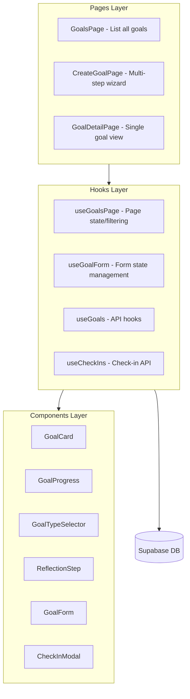
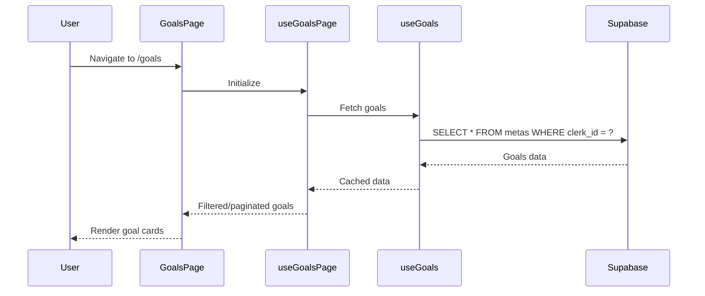

# Metas (Goals) Section Implementation Plan

## Status: ✅ Completed

All tasks have been implemented successfully on January 13, 2026.

---

## Overview
Implement a complete "Metas" section inspired by the Japanese Kakeibo method, featuring conscious reflection, goal tracking, and periodic check-ins. The implementation follows the existing codebase patterns using React Router, TanStack Query, Supabase, and shadcn/ui components.

---

## Architecture



---

## Implementation Details

### 1. Database Schema (Supabase)

Created two tables with the following SQL:

**Table: `metas`**
| Column | Type | Description |
|--------|------|-------------|
| id | uuid | Primary key (auto-generated) |
| user_id | uuid | FK to usuarios table |
| clerk_id | text | Clerk user ID for filtering |
| titulo | text | Goal title |
| tipo | text | 'economizar', 'reduzir', 'quitar', 'personalizada' |
| descricao | text | Optional description |
| valor_alvo | numeric(12,2) | Target amount |
| valor_atual | numeric(12,2) | Current progress (default 0) |
| prazo | date | Deadline |
| status | text | 'ativa', 'concluida', 'pausada' (default 'ativa') |
| categoria_id | int | FK to categorias (for reduce goals) |
| cartao_id | int | FK to cartoes (for debt goals) |
| reflexao_porque | text | Kakeibo reflection: why this goal matters |
| reflexao_mudanca | text | Kakeibo reflection: what to change |
| reflexao_sentimento | text | Kakeibo reflection: how you'll feel |
| created_at | timestamptz | Creation timestamp |
| updated_at | timestamptz | Auto-updated timestamp via trigger |

**Table: `meta_checkins`**
| Column | Type | Description |
|--------|------|-------------|
| id | uuid | Primary key (auto-generated) |
| meta_id | uuid | FK to metas (CASCADE delete) |
| clerk_id | text | Clerk user ID for filtering |
| data | date | Check-in date (default current date) |
| humor | text | 'positivo', 'neutro', 'negativo' |
| obstaculos | text | Obstacles faced |
| valor_adicionado | numeric(12,2) | Amount added this period |
| nota | text | Optional note |
| created_at | timestamptz | Creation timestamp |

**Indexes created:**
- `idx_metas_clerk_id` - Fast user queries
- `idx_metas_status` - Filter by status
- `idx_metas_tipo` - Filter by type
- `idx_meta_checkins_meta_id` - Fast check-in lookups
- `idx_meta_checkins_clerk_id` - Fast user queries
- `idx_meta_checkins_data` - Date-based queries

**RLS Policies:** Enabled with permissive policies; filtering handled in application layer via `clerk_id`.

---

### 2. API Hooks Created

**`src/hooks/api/useGoals.ts`**
- `useGoals(status?)` - Fetch all goals with optional status filter
- `useGoal(id)` - Fetch single goal by ID
- `useGoalsSummary()` - Get aggregated stats (total, active, completed, paused)
- `useCreateGoal()` - Create new goal with user association
- `useUpdateGoal()` - Update goal fields
- `useUpdateGoalProgress()` - Add value to goal and auto-complete if target reached
- `useDeleteGoal()` - Delete goal and associated check-ins

**`src/hooks/api/useCheckIns.ts`**
- `useCheckIns(metaId)` - Fetch check-ins for a specific goal
- `useRecentCheckIns(limit)` - Fetch recent check-ins across all goals
- `useCreateCheckIn()` - Create new check-in
- `useUpdateCheckIn()` - Update existing check-in
- `useDeleteCheckIn()` - Delete check-in

---

### 3. Page Hooks Created

**`src/hooks/useGoalsPage.ts`**
- Manages page-level state: filtering, pagination
- Combines `useGoals` and `useGoalsSummary`
- Provides `handleRefresh` for manual data refresh
- Page size: 6 goals per page

**`src/hooks/useGoalForm.ts`**
- Multi-step form state management (3 steps)
- Step 1: Reflection data (porque, mudanca, sentimento)
- Step 2: Goal type selection
- Step 3: Goal details (titulo, valor_alvo, prazo, etc.)
- Validation per step with `canProceed()` helper
- `getSubmitData()` prepares data for API submission

---

### 4. Utility Functions Created

**`src/lib/goalUtils.ts`**
- `calculateProgress(current, target)` - Returns percentage (0-100)
- `calculateMonthsRemaining(deadline)` - Months until deadline
- `calculateDaysRemaining(deadline)` - Days until deadline
- `calculateMonthlySuggestion(target, current, deadline)` - Suggested monthly amount
- `calculateGoalHealth(current, target, createdAt, deadline)` - Returns 'ahead' | 'on_track' | 'behind' | 'completed'
- `getGoalTypeLabel(tipo)` - Portuguese labels for goal types
- `getGoalStatusLabel(status)` - Portuguese labels for statuses
- `getGoalTypeColors(tipo)` - Tailwind color classes per type
- `formatCurrency(value)` - BRL currency formatter
- `formatDate(dateString)` - Brazilian date format
- `getProgressFeedback(health)` - Motivational messages based on progress
- `reflectionPrompts` - Kakeibo-inspired reflection questions
- `moodOptions` - Check-in mood emoji options
- `goalTypeOptions` - Goal type cards configuration

---

### 5. Components Created

**Goal Page Components (`src/pages/authenticated/goals/components/`)**

| Component | Description |
|-----------|-------------|
| `GoalCard.tsx` | Card displaying goal summary with progress bar, type icon, status badge, days remaining |
| `GoalProgress.tsx` | Reusable progress bar with percentage and currency labels |
| `GoalTypeSelector.tsx` | 4-card grid for selecting goal type (economizar, reduzir, quitar, personalizada) |
| `ReflectionStep.tsx` | 3 textarea fields with Kakeibo prompts and hints |
| `GoalForm.tsx` | Dynamic form based on goal type (shows category selector for "reduzir", card selector for "quitar") |
| `SummaryCards.tsx` | 4 metric cards showing total, active, completed, paused goals |
| `PageHeader.tsx` | Title, description, refresh and "Nova Meta" buttons |
| `GoalsGrid.tsx` | Responsive grid layout for goal cards |
| `GoalHistory.tsx` | Timeline of check-ins with mood emoji and value added |
| `EmptyState.tsx` | Friendly empty state with CTA to create first goal |
| `FilterTabs.tsx` | Status filter buttons (Todas, Em andamento, Concluídas, Pausadas) |
| `KakeiboTip.tsx` | Rotating Kakeibo wisdom tips |
| `index.ts` | Barrel export for all components |

**Check-in Modal Components (`src/components/dialogs/checkin-modal/`)**

| Component | Description |
|-----------|-------------|
| `index.tsx` | Main modal with form handling and goal progress update |
| `MoodSelector.tsx` | 3-button emoji selector (😊 😐 😟) |
| `ObstaclesField.tsx` | Textarea for obstacles faced |
| `ProgressFeedback.tsx` | Dynamic feedback card based on mood selection |
| `ValueField.tsx` | Currency input for amount added |
| `NoteField.tsx` | Optional note input |
| `FormActions.tsx` | Cancel and Submit buttons |

---

### 6. Pages Created

**`src/pages/authenticated/goals/index.tsx`** - Goals List Page
- Displays summary cards with goal statistics
- Filter tabs for status filtering
- Paginated grid of goal cards
- Empty state when no goals exist
- Kakeibo tip of the day

**`src/pages/authenticated/goals/create/index.tsx`** - Create Goal Wizard
- 3-step wizard with progress indicator
- Step 1: Kakeibo reflection questions
- Step 2: Goal type selection (4 options)
- Step 3: Goal details form (dynamic based on type)
- Validation prevents proceeding without required fields

**`src/pages/authenticated/goals/[id]/index.tsx`** - Goal Detail Page
- Large progress display with percentage
- Deadline and monthly suggestion metrics
- Progress feedback based on goal health
- Reflection reminder card showing original motivation
- Check-in history timeline
- Actions: Make Check-in, Pause/Resume, Delete goal

---

### 7. Navigation Updates

**`src/components/AppSidebar.tsx`**
- Added `Target` icon import from lucide-react
- Added "Metas" nav item pointing to `/goals`

```typescript
const navItems = [
  { title: "Dashboard", url: "/", icon: BarChart3 },
  { title: "Transações", url: "/transactions", icon: ArrowLeftRight },
  { title: "Categorias", url: "/categories", icon: Tag },
  { title: "Futuros", url: "/future-launches", icon: CalendarClock },
  { title: "Metas", url: "/goals", icon: Target },  // ADDED
  { title: "Cartões", url: "/cards", icon: CreditCard },
];
```

**`src/App.tsx`**
- Added imports for GoalsPage, CreateGoalPage, GoalDetailPage
- Added routes:
```typescript
<Route path="/goals" element={<GoalsPage />} />
<Route path="/goals/create" element={<CreateGoalPage />} />
<Route path="/goals/:id" element={<GoalDetailPage />} />
```

---

## File Structure (Final)

```
src/
├── pages/authenticated/goals/
│   ├── index.tsx                    # Goals list page
│   ├── create/
│   │   └── index.tsx                # Multi-step goal creation wizard
│   ├── [id]/
│   │   └── index.tsx                # Goal detail page
│   └── components/
│       ├── GoalCard.tsx
│       ├── GoalProgress.tsx
│       ├── GoalTypeSelector.tsx
│       ├── GoalForm.tsx
│       ├── ReflectionStep.tsx
│       ├── SummaryCards.tsx
│       ├── PageHeader.tsx
│       ├── GoalsGrid.tsx
│       ├── GoalHistory.tsx
│       ├── EmptyState.tsx
│       ├── FilterTabs.tsx
│       ├── KakeiboTip.tsx
│       └── index.ts
├── components/dialogs/checkin-modal/
│   ├── index.tsx
│   └── components/
│       ├── MoodSelector.tsx
│       ├── ObstaclesField.tsx
│       ├── ProgressFeedback.tsx
│       ├── ValueField.tsx
│       ├── NoteField.tsx
│       ├── FormActions.tsx
│       └── index.ts
├── hooks/
│   ├── api/
│   │   ├── useGoals.ts
│   │   └── useCheckIns.ts
│   ├── useGoalsPage.ts
│   └── useGoalForm.ts
└── lib/
    └── goalUtils.ts
```

---

## Goal Types and Calculation Rules

| Type | Portuguese | Icon | Color | Data Used | Monthly Suggestion |
|------|------------|------|-------|-----------|-------------------|
| Save | Economizar | PiggyBank | Blue | Target amount, deadline | `(target - current) / monthsRemaining` |
| Reduce | Reduzir Gastos | TrendingDown | Orange | Category selection | Suggest 10-20% reduction |
| Pay Debt | Quitar Dívida | CreditCard | Red | Card selection | Based on card balance |
| Custom | Personalizada | Target | Purple | User-defined | Based on deadline |

---

## Kakeibo-Inspired Copy

### Reflection Questions (Step 1)
- **Por que?** "Por que essa meta é importante para você agora?" - Hint: Pense além do dinheiro. É sobre segurança? Liberdade? Realizar um sonho antigo?
- **Mudança:** "O que você está disposto a ajustar para alcançá-la?" - Hint: Toda escolha envolve uma troca. Pode ser reduzir o delivery ou renegociar um serviço.
- **Sentimento:** "Como você se sentirá ao conquistar isso?" - Hint: Visualize o sucesso. Essa emoção será seu combustível nos dias difíceis.

### Check-in Questions
- "Como foi sua semana em relação a esta meta?"
- "Algum obstáculo que você enfrentou?"

### Progress Feedback Messages
| Health | Title | Message |
|--------|-------|---------|
| completed | 🎉 Parabéns! | Você conquistou sua meta! Que orgulho dessa conquista! |
| ahead | Excelente progresso! | Você está acima do esperado. Continue assim, está indo muito bem! |
| on_track | No caminho certo! | Você está mantendo um bom ritmo. Continue focado e consistente. |
| behind | Atenção ao progresso | Tudo bem, o importante é não desistir. Pequenos passos também contam. Que tal revisar sua estratégia? |

### Kakeibo Tips (Rotating)
1. "Se você não pode comprar à vista, talvez não deva comprar agora."
2. "Antes de gastar, pergunte-se: Eu realmente preciso disso? Posso viver sem?"
3. "Pequenas economias diárias criam grandes reservas."
4. "O objetivo não é se privar, mas fazer escolhas conscientes."

---

## State Management Flow



---

## Implementation Checklist

- [x] Create Supabase tables (metas, meta_checkins) with RLS policies
- [x] Create useGoals.ts and useCheckIns.ts API hooks
- [x] Create goalUtils.ts with calculation helpers
- [x] Build goal components (GoalCard, GoalProgress, GoalTypeSelector, etc.)
- [x] Implement GoalsPage (list view with filtering)
- [x] Implement CreateGoalPage (multi-step wizard with reflection)
- [x] Implement GoalDetailPage (single goal view with history)
- [x] Create CheckInModal dialog component
- [x] Update AppSidebar and App.tsx with new routes

---

## Notes

- All UI uses existing shadcn components and the app's design system (rounded-3xl cards, border-border, etc.)
- Portuguese language throughout to match existing app copy
- Data is filtered by `clerk_id` in the application layer for multi-tenant security
- Auto-completes goal when `valor_atual >= valor_alvo`
- Uses TanStack Query for caching and optimistic updates
- Toast notifications for all CRUD operations
