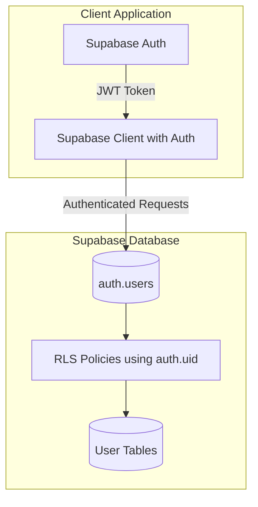

# Migration Plan: Clerk to Supabase Auth + RLS Implementation

## Status: ✅ Completed

All tasks have been implemented successfully.

---

## Overview

This plan migrates the authentication system from Clerk to Supabase Auth and implements Row Level Security (RLS) on all tables. This approach provides native integration, cleaner code, and proper database-level security using Supabase's built-in `auth.uid()` function.

## Architecture

## Implementation Summary

### Phase 1: Database Schema Updates ✅

**Migration Files Created:**
- `supabase/migrations/001_migrate_to_supabase_auth.sql` - Schema migration
- `supabase/migrations/002_enable_rls.sql` - Enable RLS on all tables
- `supabase/migrations/003_create_rls_policies.sql` - Create RLS policies
- `supabase/migrations/004_migrate_existing_users.sql` - Data migration (optional)

**Changes:**
- Added `auth_user_id` column to `usuarios` table
- Ensured all tables have `user_id` (UUID) columns
- Created foreign key constraints
- Enabled RLS on all user-facing tables
- Created comprehensive RLS policies using `auth.uid()`

### Phase 2: Authentication System Migration ✅

**Files Created:**
- `apps/web/src/contexts/AuthContext.tsx` - Auth context provider
- `apps/web/src/routes/auth/callback.tsx` - OAuth callback handler

**Files Modified:**
- `apps/web/src/integrations/supabase/client.ts` - Updated for Supabase Auth
- `apps/web/src/main.tsx` - Replaced ClerkProvider with AuthProvider
- `apps/web/src/hooks/useLoginForm.ts` - Uses `supabase.auth.signInWithPassword`
- `apps/web/src/hooks/useRegisterForm.ts` - Uses `supabase.auth.signUp`
- `apps/web/src/components/GoogleLoginButton.tsx` - Supabase OAuth
- `apps/web/src/components/GoogleRegisterButton.tsx` - Supabase OAuth
- `apps/web/src/components/AppSidebar.tsx` - Supabase signOut
- `apps/web/src/routes/_authenticated.tsx` - Supabase session check
- `apps/web/src/routes/login.tsx` - Supabase session check

### Phase 3: API Hooks Updates ✅

**Files Modified:**
- `apps/web/src/hooks/api/useGoals.ts` - Removed Clerk, uses RLS
- `apps/web/src/hooks/api/useCheckIns.ts` - Removed Clerk, uses RLS
- `apps/web/src/hooks/api/useFutureLaunches.ts` - Removed Clerk, uses RLS
- `apps/web/src/hooks/api/useExpenses.ts` - Added user_id support, uses RLS
- `apps/web/src/hooks/api/useIncomes.ts` - Added user_id support, uses RLS
- `apps/web/src/hooks/api/useCategories.ts` - Added user_id support, uses RLS
- `apps/web/src/hooks/api/useCards.ts` - Added user_id support, uses RLS

**Key Changes:**
- Removed all `@clerk/clerk-react` dependencies
- Removed application-layer filtering (`.eq("clerk_id", ...)`)
- RLS now handles all data filtering automatically
- Mutations get `user_id` from `usuarios` table using `auth_user_id`

### Phase 4: Cleanup ✅

- Removed `@clerk/clerk-react` from `package.json`
- Updated `ENV_SETUP.md` to remove Clerk references
- Created migration README with execution instructions

## Migration Execution Order

1. **001_migrate_to_supabase_auth.sql** - Schema changes
2. **002_enable_rls.sql** - Enable RLS (tables locked until step 3)
3. **003_create_rls_policies.sql** - Create policies (unlocks tables)
4. **004_migrate_existing_users.sql** - Data migration (optional)

See `supabase/migrations/README.md` for detailed instructions.

## Benefits Achieved

- ✅ Native Supabase integration
- ✅ Proper database-level security with RLS
- ✅ Cleaner code (no session variables or workarounds)
- ✅ Better performance (RLS at database level)
- ✅ Simpler authentication flow
- ✅ One less dependency (removed Clerk)
- ✅ Automatic data filtering (no manual `.eq()` calls needed)

## Testing Status

- ⏳ Authentication flows (sign up, sign in, OAuth, sign out) - Pending
- ⏳ RLS policies verification - Pending

## Related Documentation

- See `docs/clerk-to-supabase-auth-benefits.md` for detailed explanation of why we migrated and the benefits
